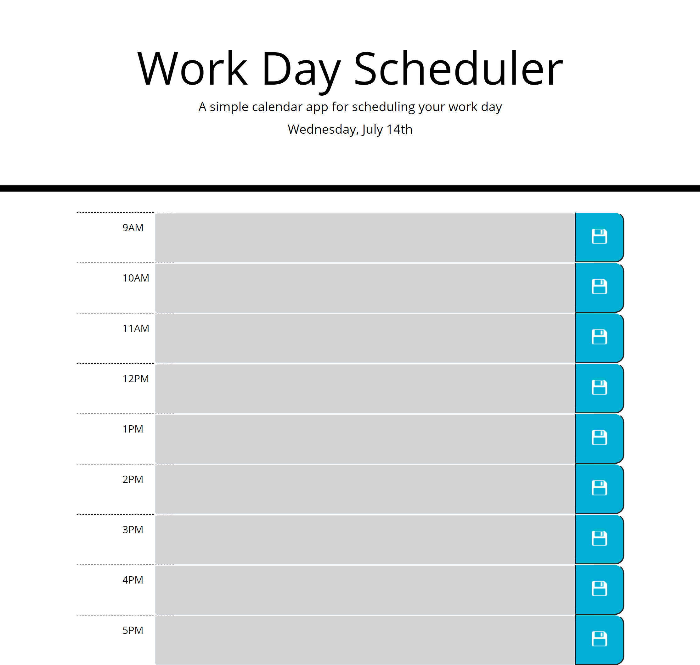

# Work Day Scheduler Starter Code
## Description 
This project is to utilize bootstrap styling, and add important events to the daily planner to manage my time effectively using jquery & moment.js. 

## Link to deployed application 
https://jessibewu.github.io/work-day-scheduler/

## Usage 
Below is a screenshot of the application: 

 

## Credits: 
https://courses.bootcampspot.com/

## License: 
Licensed under the MIT license.
